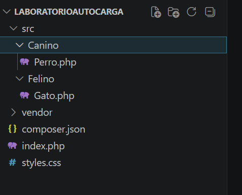
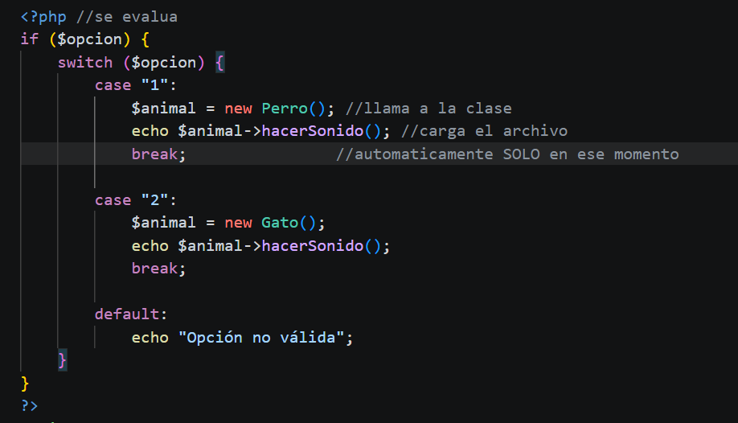

# Laboratorio: Autoload con Composer en PHP

## 📌 Descripción

Este proyecto demuestra el uso de autoload con Composer utilizando el estándar PSR-4, permitiendo cargar
clases automáticamente sin necesidad de include

El sistema consiste en una pequeña aplicación donde el usuario selecciona un animal (Perro o Gato) y el 
sistema instancia únicamente la clase necesaria en ese momento.

---

## ⚙️ Guía de Instalación

1. Clonar el repositorio:
   
Para ejecutar el proyecto debes abrir tu terminal CMD y ve a una carpeta donde quieras guardar el proyecto
ejemplo

```
cd Documents
```
una vez  dentro de la carpeta ejecuta el siguiente comando

```
git clone https://github.com/Kathlyn71/Autocarga
```
esto creo automaticamente una carpteta llamada Autocarga con todo el proyecto

2. En visual Studio Code debes Entrar al proyecto: Autocarga

3. En una terminal en Visual ejecuta el comando para Generar el autoload:

```
composer dump-autoload
```

---

## 📂 Estructura de archivos del Proyecto




---

## 🔗 Relación Namespace y Carpeta

| Namespace        | Ruta Física      |
| ---------------- | ---------------- |
| App\Canino       | src/Canino       |
| App\Felino\Model | src/Felino/Model |

---

## ▶️ Pruebas de Ejecución

Inicia WAMP y en el navegador busca su ubicacion:
http://localhost/laboratorioautocarga


La aplicación permite al usuario seleccionar un animal mediante una opción en pantalla.
Según la opción elegida, el sistema instancia la clase correspondiente y muestra el sonido del animal.


El siguiente fragmento de código demuestra cómo el sistema evalúa la opción del usuario y carga
dinámicamente la clase correspondiente utilizando autoload:



Cuando el usuario selecciona una opción, el sistema evalúa el valor con switch.
Al crear el objeto (new Perro() o new Gato()), Composer carga automáticamente la clase necesaria.
No se utilizan include ni require manuales.
Solo se carga la clase correspondiente en el momento de uso.

Esto demuestra que el sistema carga dinámicamente la clase necesaria según la interacción del usuario.


### 🔹 Ejemplo 1

Opción: Perro
Resultado: Guau Guau
El usuario elige **Perro** se carga `Perro.php`


### 🔹 Ejemplo 2

Opción: Gato
Resultado: Miau
El usuario elige **Gato** → se carga `Gato.php`


---

## 📊 Conclusiones Técnicas

Este laboratorio demuestra cómo Composer simplifica la gestión de clases en PHP moderno, permitiendo
una mejor organización, eficiencia y escalabilidad del código.

### 🔹 1. Mantenibilidad

El uso de autoload permite agregar nuevas clases sin modificar archivos globales, facilitando la
escalabilidad y mantenimiento del sistema.

### 🔹 2. Eficiencia de Memoria

El sistema implementa carga bajo demanda, lo que evita cargar clases innecesarias, optimizando el
uso de memoria y mejorando el rendimiento.

### 🔹 3. Estandarización

El uso del estándar PSR-4 permite organizar el código de forma clara y consistente, facilitando el
trabajo colaborativo y la comprensión del proyecto.


---

## 👩‍🎓 Información del Estudiante

Nombre: Kathlyn Morales 8-1002-2278

Materia: Software 7

Profesor: Irina Fong

Laboratorio: Autocarga de Clases con Composer

---

